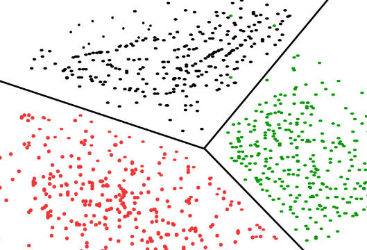

# Performance in a cluster

https://github.com/duncanhealy/presentation-cluster-perf-nodejs





[](https://asciinema.org/a/HKnUr4XL9BCBVbHkqDqDcn8gE?autoplay=1&speed=3&theme=tango&size=medium)


### Rollback

[](https://asciinema.org/a/WNXtJjKiydFjij0WG6PpWuT02?autoplay=1&speed=3&theme=tango&size=medium)


[](https://asciinema.org/a/e2SSEIMrPmpjtwM8oD7XFjKyQ?autoplay=1&speed=3&theme=tango&size=medium)


[Report](reports/report.json.html)


[limits](reports/report.limit.html)


[limits](reports/50.json.html)


[hpa4](reports/hpa4.json.html)

## Scaling


### more replica


```yaml
{{- if .Values.autoscaleMin }}
apiVersion: autoscaling/v2beta1
kind: HorizontalPodAutoscaler
metadata:
    name: {{ .Chart.Name }}
    namespace: {{ .Release.Namespace }}
    annotations:
      alpha/target.custom-metrics.podautoscaler.kubernetes.io: '{"items":[{"name":"qps", "value": "20"}]}'
spec:
    maxReplicas: {{ .Values.autoscaleMax }}
    minReplicas: {{ .Values.autoscaleMin }}
    targetCPUUtilizationPercentage: 80
    scaleTargetRef:
      apiVersion: apps/v1beta1
      kind: Deployment
      name: {{ .Values.service.name }}-{{ .Chart.Version | replace "." "-"  }}
{{ end }}
```


[post hpa](reports/hpa.json.html)

---

## My clustered History

### First pc ZX Spectrum 

```Basic
10 INPUT a 
20 PRINT CHR$ a;
30 GO TO 10
```
- Lead to Peeking + Poking around code 

```Basic
10 FOR n=0 TO 10
20 PRINT PEEK (23755+n)
30 NEXT n
```


* All the cheats


### IBM PC

* Games - Civ, Elite, Warcraft ..


### Solaris

```shell
man man
```


### FreeBSD

- Cultivating dot files era all important prompt hacks
```bash
if [ -n "$force_color_prompt" ]; then
    if [ -x /usr/bin/tput ] && tput setaf 1 >&/dev/null; then
	color_prompt=yes
    else
	color_prompt=
    fi
fi
if [ "$color_prompt" = yes ]; then
    PS1='${debian_chroot:+($debian_chroot)}\[\033[01;32m\]\u@\h\[\033[00m\]:\[\033[01;34m\]\w\[\033[00m\]\$ '
else
    PS1='${debian_chroot:+($debian_chroot)}\u@\h:\w\$ '
fi
unset color_prompt force_color_prompt
# If this is an xterm set the title to user@host:dir
case "$TERM" in
xterm*|rxvt*)
    PS1="\[\e]0;${debian_chroot:+($debian_chroot)}\u@\h: \w\a\]$PS1"
    ;;
*)
    ;;
esac
```

* FF to today


### Docker

* Bash and shell scripts still have relevance for constructing container images

```docker
# ### STAGE 1: Build ###
# FROM node:9.8 as builder
# ENV APP_PATH /app
# ## Storing node modules on a separate layer will prevent unnecessary npm installs at each build
# ## Build the angular app in production mode and store the artifacts in dist folder
# RUN npm run build
### STAGE 2: Setup ###
FROM nginx:1.13.12-alpine
RUN apk repo update && apk add curl
ENV APP_PATH /app
## Copy our default nginx config
RUN rm -rf /etc/nginx/conf.d/*
COPY nginx/default.conf /etc/nginx/conf.d/
## Remove default nginx website
RUN rm -rf /usr/share/nginx/html/*
EXPOSE 80 4200
## to make sure there is a /dist folder here
## RUN ["/bin/sh", "npm", "run", "build"]
# COPY --from=builder $APP_PATH/dist/ /usr/share/nginx/html/
COPY ./dist /usr/share/nginx/html/
CMD ["nginx", "-g", "daemon off;"]
```


### Kubernetes

---

## Cluster Options


### require('cluster')


```js
const cluster = require('cluster')
// const http = require('http')

if (cluster.isMaster) {
  // Keep track of http requests
  numReqs = 0
  setInterval(() => {
    console.log(`numReqs = ${numReqs}`)
  }, 60000)

  // Count requests

  // Start workers and listen for messages containing notifyRequest
  let numCPUs = require('os').cpus().length
  if (numCPUs < 4) {
    numCPUs = 4
  }
  // numCPUs = 1
  for (let i = 0; i < numCPUs; i++) {
    cluster.fork()
  }

  for (const id in cluster.workers) {
    cluster.workers[id].on('message', messageHandler)
  }
} else {
  // Worker processes have a http server.
  server.listen(process.env.PORT)
}
```


### Kubernetes replicas

```yaml
apiVersion: extensions/v1beta1
kind: Deployment
metadata:
  generation: 1
  labels:
    app: loadapi
  name: loadapi-v2
spec:
  replicas: 1
  selector:
    matchLabels:
      app: loadapi
      chart: loadapi-v2
      draft: loadapi
      release: canary
      version: v2
  strategy:
    rollingUpdate:
      maxSurge: 1
      maxUnavailable: 1
    type: RollingUpdate
  template:
    metadata:
      annotations:
        buildID: 01CKNEMPBDCYWG73GAVXHFZPY6
        prometheus.io/port: "3000"
        prometheus.io/scrape: "true"
      creationTimestamp: null
      labels:
        app: loadapi
        chart: loadapi-v2
        draft: loadapi
        release: canary
        version: v2
    spec:
      containers:
      - env:
        - name: REDIS_CONNECTION_STRING
          value: redis:6380
        - name: SELECTED_CONFIG
          value: staging
        image: docker.io/loadapi:2.0.0
        imagePullPolicy: IfNotPresent
        livenessProbe:
          exec:
            command:
            - curl
            - -f
            - http://localhost:3000/echo
          failureThreshold: 3
          periodSeconds: 40
          successThreshold: 1
          timeoutSeconds: 1
        name: loadapi
        ports:
        - containerPort: 3000
          protocol: TCP
        readinessProbe:
          exec:
            command:
            - curl
            - -f
            - http://localhost:3000/echo
          failureThreshold: 3
          periodSeconds: 20
          successThreshold: 1
          timeoutSeconds: 1
        resources: {}
        terminationMessagePath: /dev/termination-log
        terminationMessagePolicy: File
        volumeMounts:
        - mountPath: /data/all
          name: data-all
      dnsPolicy: ClusterFirst
      restartPolicy: Always
      schedulerName: default-scheduler
      securityContext: {}
      terminationGracePeriodSeconds: 30
      volumes:
      - emptyDir: {}
        name: data-all
status: {}
```


### docker swarm


### pm2
```bash
npm i --save pm2
./node_modules/.bin/pm2-docker start pm2start.json

```

* pm2start.json
```json
{
  "apps": [
    {
      "name": "pricing",
      "exec_mode": "cluster",
      "instances": 4,
      "script": "index.js",
      "log_date_format": "YYYY-MM-DD HH:mm:ss.SSS",
      "node_args": "--inspect",
      "cwd": "./",
      "autorestart": true,
      "max_memory_restart": "1G",
      "cron_restart": "0 59 * * *",
      "env": {
        "NODE_PORT": "8000",
        "KEYMETRICS_PUBLIC": "x",
        "KEYMETRICS_SECRET": "y",
        "NODE_ENV": "production",
        "NODE_PATH": ".",
        "DEBUG": "socket.io-parser:1,socket.io:3,engine:1,myns:*:*",
        "TZ": "UTC",
        "PORT": "8000"
      }
    },
    {
      "name": "fetch",
      "exec_mode": "fork",
      "instances": 1,
      "script": "index2.js",
      "log_date_format": "YYYY-MM-DD HH:ss.SSS",
      "node_args": "",
      "autorestart": true,
      "max_memory_restart": "1G",
      "cron_restart": "0 9 * * *",
      "cwd": "./",
      "env": {
        "NODE_PORT": "6001",
        "KEYMETRICS_PUBLIC": "x",
        "KEYMETRICS_SECRET": "y",
        "NODE_ENV": "production",
        "NODE_PATH": ".",
        "DEBUG": "socket.io-parser:1,socket.io:3,engine:1,myns:*:*",
        "TZ": "UTC",
        "PORT": "6001"
      }
    },
    {
      "name": "db-multi/server",
      "script": "node_modules/db-multi/server.js",
      "args": "6003", // process.env.DB_MULTI_PORT,
      "env": {
        "NEDB_MULTI_INTERATIONS": "4",
        "NEDB_MULTI_PORT": "6003"
      }
    },
  ]
}
```
Note: discuss +- for each

---

## Siteload

---

## Performance measurement 


[Benchmarking in core](https://github.com/nodejs/http2/blob/master/doc/guides/writing-and-running-benchmarks.md)

[Simple Profiling](https://nodejs.org/en/docs/guides/simple-profiling/)


### Perf timers


```js
// https://nodejs.org/api/http2.html#http2_collecting_http_2_performance_metrics
const { PerformanceObserver } = require('perf_hooks');

const obs = new PerformanceObserver((items) => {
  const entry = items.getEntries()[0];
  console.log(entry.entryType);  // prints 'http2'
  if (entry.name === 'Http2Session') {
    // entry contains statistics about the Http2Session
  } else if (entry.name === 'Http2Stream') {
    // entry contains statistics about the Http2Stream
  }
});
obs.observe({ entryTypes: ['http2'] });
```


```shell
time node task-countTo10e8.js
```
```text
real    0m4.096s
user    0m4.086s
sys     0m0.012s
```


### Graphing


#### 0x

```
  0x --cmd <command> [args]
  0x -c <command> [args]

  Commands

    gen:
    The gen command will regenerate the flamegraph from
    a JSON or stacks.out file (autodetected)

    Create a flamegraph from a stacks file (e.g. dtrace
    and perf script output)

    0x -c gen [flags] <stacks.<pid>.out file>

    Flags include `--tiers` and `--langs`

```

### Metrics


* bench-rest
* artillery
* [bubbleprof](https://github.com/nearform/node-clinic-bubbleprof) *:)* _Nearform_

Note: Precision vs ease of use

---

## Load Generation


### Artillery


### Task
* Prime number
* Sleep
* some network task
* some async db work


### docker-hey


### Loadtest

https://github.com/loadimpact/loadgentest


### httpstat


Note: httpstat

---


---

## Test 

---

## Initial results


### single node - socket data


```
Report @ 14:18:33(+0100) 2018-10-25
  Scenarios launched:  50
  Scenarios completed: 50
  Requests completed:  2500
  RPS sent: 261.51
  Request latency:
    min: 29.6
    max: 2408
    median: 103.9
    p95: 305
    p99: 840
  Codes:
    200: 2500
```


```
All virtual users finished
Summary report @ 14:18:33(+0100) 2018-10-25
  Scenarios launched:  50
  Scenarios completed: 50
  Requests completed:  2500
  RPS sent: 261.23
  Request latency:
    min: 29.6
    max: 2408
    median: 103.9
    p95: 305
    p99: 840
  Scenario counts:
    0: 50 (100%)
  Codes:
    200: 2500
```


## Concurrent


```
Report @ 14:18:41(+0100) 2018-10-25
  Scenarios launched:  0
  Scenarios completed: 37
  Requests completed:  686
  RPS sent: 188.67
  Request latency:
    min: 28.4
    max: 394.1
    median: 75
    p95: 194.5
    p99: 351
  Codes:
    200: 686
```


```
All virtual users finished
Summary report @ 14:18:41(+0100) 2018-10-25
  Scenarios launched:  50
  Scenarios completed: 50
  Requests completed:  2500
  RPS sent: 184.37
  Request latency:
    min: 28.4
    max: 6602.5
    median: 85.2
    p95: 231.4
    p99: 5633.2
  Scenario counts:
    0: 50 (100%)
  Codes:
    200: 2500
```


```json
[{\"CallAskDelta\":0.690592,\"CallAskGamma\":0.310353,\"CallAskRate\":0.008357999999999999,\"CallAskTheta\":-0.000164,\"CallAskVega\":0.000611,\"CallAskVolatility\":0.06554918098946987,\"CallBidDelta\":0.690592,\"CallBidGamma\":0.310353,\"CallBidRate\":0.007307999999999999,\"CallBidTheta\":-0.000164,\"CallBidVega\":0.000611,\"CallBidVolatility\":0.06554918098946987,\"Decimals\":5,\"ExpirationDate\":\"2018-11-08T15:00:00\",\"Product\":\"EUR/GBP\",\"PutAskDelta\":-0.309634,\"PutAskGamma\":0.310353,\"PutAskRate\":0.002799,\"PutAskTheta\":-0.000134,\"PutAskVega\":0.000611,\"PutAskVolatility\":0.06554918098946987,\"PutBidDelta\":-0.309634,\"PutBidGamma\":0.310353,\"PutBidRate\":0.0017490000000000001,\"PutBidTheta\":-0.000134,\"PutBidVega\":0.000611,\"PutBidVolatility\":0.06554918098946987,\"SpotAsk\":0.88538,\"SpotBid\":0.88488,\"Strike\":0.88,\"Tenor\":\"14D\",\"TradeDate\":\"2018-10-25T13:28:15\",\"id\":\":EUR/GBP:0.88000:2018-11-08:true\",\"realtime\":0.88504,\"timestamp\":1540472400,\"fxsource\":\"\",\"source\":\"flattened\",\"_id\":\"JRnEFF0wqcCl8A7O\",\"createdAt\":\"2018-10-25T13:28:16.745Z\",\"updatedAt\":\"2018-10-25T13:28:16.745Z\"}]
 ```


```
 Report @ 14:28:17(+0100) 2018-10-25
  Scenarios launched:  1
  Scenarios completed: 1
  Requests completed:  10
  RPS sent: 3.36
  Request latency:
    min: 69
    max: 1944.8
    median: 70.9
    p95: 1944.8
    p99: 1944.8
  Codes:
    200: 10
```


```
All virtual users finished
Summary report @ 14:28:17(+0100) 2018-10-25
  Scenarios launched:  1
  Scenarios completed: 1
  Requests completed:  10
  RPS sent: 3.36
  Request latency:
    min: 69
    max: 1944.8
    median: 70.9
    p95: 1944.8
    p99: 1944.8
  Scenario counts:
    0: 1 (100%)
  Codes:
    200: 10
```


## 10 @ 10


```
Report @ 14:30:11(+0100) 2018-10-25
  Scenarios launched:  10
  Scenarios completed: 10
  Requests completed:  100
  RPS sent: 42.02
  Request latency:
    min: 53.1
    max: 254.7
    median: 130.5
    p95: 217.9
    p99: 253.3
  Codes:
    200: 100
```


```
All virtual users finished
Summary report @ 14:30:12(+0100) 2018-10-25
  Scenarios launched:  10
  Scenarios completed: 10
  Requests completed:  100
  RPS sent: 42.02
  Request latency:
    min: 53.1
    max: 254.7
    median: 130.5
    p95: 217.9
    p99: 253.3
  Scenario counts:
    0: 10 (100%)
  Codes:
    200: 100
```


## 50 @50 


```
Report @ 14:31:48(+0100) 2018-10-25
  Scenarios launched:  0
  Scenarios completed: 42
  Requests completed:  298
  RPS sent: 63.21
  Request latency:
    min: 58.8
    max: 673.6
    median: 557.1
    p95: 630.4
    p99: 665.9
  Codes:
    200: 298
```


```
All virtual users finished
Summary report @ 14:31:48(+0100) 2018-10-25
  Scenarios launched:  50
  Scenarios completed: 50
  Requests completed:  2500
  RPS sent: 56.78
  Request latency:
    min: 38.2
    max: 10875.5
    median: 640.2
    p95: 951
    p99: 10033.9
  Scenario counts:
    0: 50 (100%)
  Codes:
    200: 2500
```


## 100 @ 100 


```
Report @ 14:40:18(+0100) 2018-10-25
  Scenarios launched:  0
  Scenarios completed: 34
  Requests completed:  56
  RPS sent: 14.77
  Request latency:
    min: 83.8
    max: 1738.1
    median: 1547.6
    p95: 1700.5
    p99: 1736.2
  Codes:
    200: 56
```


```
All virtual users finished
Summary report @ 14:40:18(+0100) 2018-10-25
  Scenarios launched:  100
  Scenarios completed: 100
  Requests completed:  10000
  RPS sent: 26.91
  Request latency:
    min: 50.5
    max: 22625.3
    median: 2964.8
    p95: 5149.9
    p99: 19554.8
  Scenario counts:
    0: 100 (100%)
  Codes:
    200: 10000
```


## Add a pod


```
Report @ 15:01:41(+0100) 2018-10-25
  Scenarios launched:  100
  Scenarios completed: 0
  Requests completed:  3526
  RPS sent: 360.56
  Request latency:
    min: 28.5
    max: 7563.2
    median: 136.9
    p95: 349.6
    p99: 2251.9
  Codes:
    200: 3526
```


```
Report @ 15:01:51(+0100) 2018-10-25
  Scenarios launched:  0
  Scenarios completed: 51
  Requests completed:  3850
  RPS sent: 381.82
  Request latency:
    min: 29.8
    max: 13865.7
    median: 155.3
    p95: 412.3
    p99: 613.7
  Codes:
    200: 3850
```


```
Report @ 15:02:01(+0100) 2018-10-25
  Scenarios launched:  0
  Scenarios completed: 42
  Requests completed:  2184
  RPS sent: 214.41
  Request latency:
    min: 29.6
    max: 25908.6
    median: 83
    p95: 208.7
    p99: 305.4
  Codes:
    200: 2184
```


```
Report @ 15:02:07(+0100) 2018-10-25
  Scenarios launched:  0
  Scenarios completed: 7
  Requests completed:  440
  RPS sent: 70.11
  Request latency:
    min: 30.2
    max: 173
    median: 74.1
    p95: 108.2
    p99: 140.8
  Codes:
    200: 440
```


```
All virtual users finished
Summary report @ 15:02:07(+0100) 2018-10-25
  Scenarios launched:  100
  Scenarios completed: 100
  Requests completed:  10000
  RPS sent: 275.86
  Request latency:
    min: 28.5
    max: 25908.6
    median: 122.3
    p95: 357.6
    p99: 629.7
  Scenario counts:
    0: 100 (100%)
  Codes:
    200: 10000
```

<!-- .slide: data-background="./images/image1.png" -->

---

## Demo


### Transform

```js
  return new require('stream').Transform({
    transform: function transformer(chunk, encoding, callback){
        // callback(<error>, <result>)
        callback(false, chunk.map(a => {
            // operations on Buffer 
            return a 
        })
    }
  })
```


## Linkerd 


[](https://asciinema.org/a/BZ9DQZkhXTY8Q2LCCtpucdUVP?autoplay=1&speed=3&theme=tango&size=medium)


## Tool List

```text
> curl
> http
> git
> slack
> node
> npm
> n
> python
> helm - 	curl https://raw.githubusercontent.com/helm/helm/master/scripts/get | sudo bash
> kubectl
> firefox
> kubectx
> kubens
> go
> bup
> Postman
> VirtuaBox
> mosh
> ufw
> docker - curl -fsSL get.docker.com -o get-docker.sh
> docker-compose - curl -L https://github.com/docker/compose/releases/download/1.22.0/docker-compose-'uname -s’-‘uname -m’ -o /usr/local/bin/docker-compose
> brigade
> draft
> az
> gcloud
> aws
> jq
> jpterm
> htop
> ngrok
> microk8s - snap install microk8s --classic --beta
> ng - npm install -g @angular/cli
> workbox - npm install workbox-cli --global
```


## testing

```text

> k6
> fortio
> artillery
> bubbleprof
```


```
Remember to switch those devices off :)
```